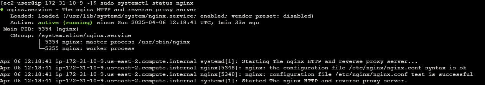

# wazuh-siem-project

# SIEM Project with Wazuh on AWS EC2

## Overview
This project involves setting up and configuring a Security Information and Event Management (SIEM) system using Wazuh on an Amazon EC2 instance. The project is hosted on Amazon Linux 2 with a t2.micro instance type, ensuring it stays within the AWS Free Tier limits. 

The main goal was to configure Wazuh Manager and test its functionality by logging into the EC2 instance with an incorrect PEM key, which was then logged by Wazuh.

## Steps

### 1. Launching EC2 Instance
- Created a t2.micro EC2 instance on AWS using Amazon Linux 2.
- Configured security groups to allow necessary traffic (e.g., SSH, HTTP, and custom ports for Wazuh).
- Downloaded the necessary PEM key for secure SSH login.
- Successfully set up instance

### 2. Installing Wazuh Manager
- Installed Wazuh Manager on the EC2 instance. This was done by following the installation guide provided via https://documentation.wazuh.com/current/installation-guide/wazuh-server/step-by-step.html
- Configured the manager to collect security-related logs, such as login attempts and system activity.

- Ensured Wazuh was correctly processing and analyzing logs.

### 3. Testing Configuration
- Attempted logging in with an incorrect PEM key to simulate an unauthorized access attempt.

- The failed login attempt with an incorrect PEM key was successfully logged and flagged by Wazuh, confirming the system's functionality.

### 4. Installing and Configuring Nginx
- Installed Nginx on the EC2 instance to serve as a web server.
- Configured Nginx to log HTTP requests and errors.

- Integrated Nginx logs into Wazuh to monitor HTTP access attempts.

### 5. Testing Nginx Integration
- Used a `curl` command to access the HTTP link on the server, resulting in a "no token" error.

- The failed HTTP login attempt was logged by Wazuh, confirming the integration and functionality of Nginx with the SIEM system.

## Requirements
- AWS account with access to EC2.
- Wazuh Manager installation on Amazon Linux 2.
- Nginx installation and integration onto Wazuh.
